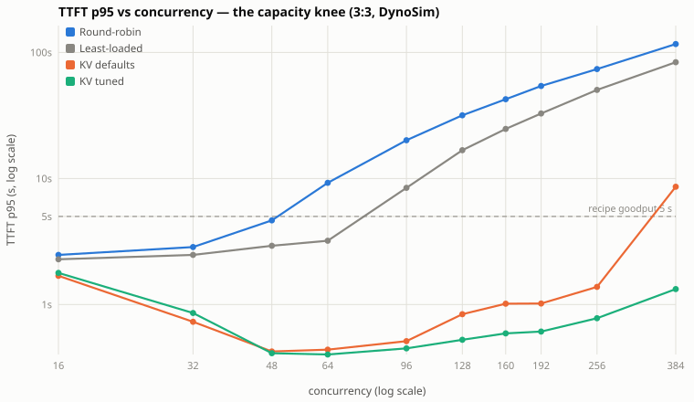
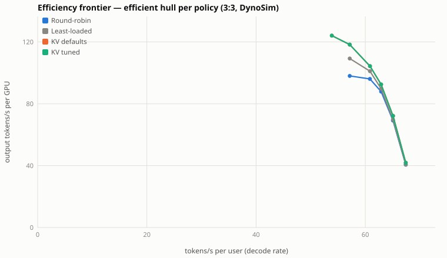
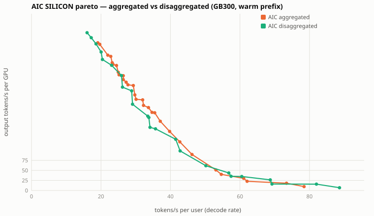

# Pareto curves & learnings — Kimi-K2.5 KV-aware routing on GB300

Static exports (GitHub renders these inline). Interactive versions with hover
metadata and table views: `pareto_dynosim_v5.html`, `learnings_six_curves.html`
(open locally in a browser).

## The capacity knee — TTFT p95 vs concurrency
KV-aware routing stays flat while cache-blind policies queue-diverge.

## Efficiency frontier (efficient hull per policy)

## AIC SILICON pareto — aggregated vs disaggregated

All curves: DynoSim v4+v5 (silicon-calibrated) and aiconfigurator SILICON solves;
session-interleaved Weka 256k trace; details in ../SWEEP_METHODOLOGY.md.
Live round-1 measurements overlay as they land.
